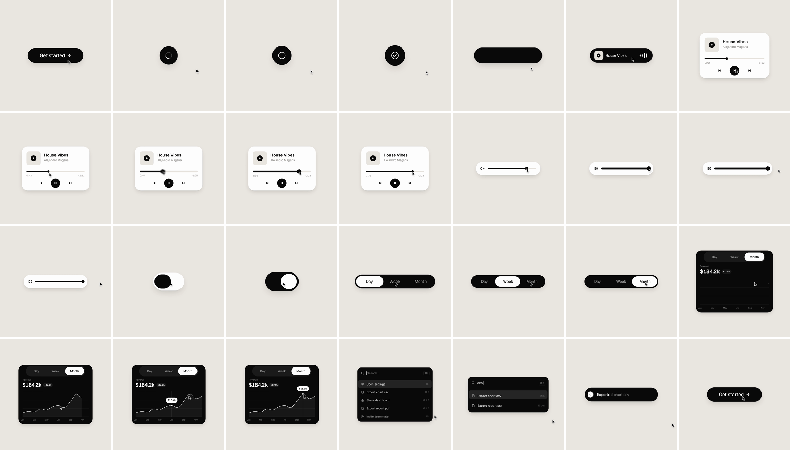

# One Shape

A 14-second, seamlessly looping UI motion piece: one shape that never cuts, morphing
through 12 UI states on a 120 BPM grid (7 bars, 28 beats).

**Output:** [`out/one-shape.mp4`](out/one-shape.mp4) (1440×1440, 60 fps, H.264 + AAC).
Open `index.html` to watch it live in a browser.



| Bar | Beats | States |
|---|---|---|
| 1 | 1–4 | Button → loader → check |
| 2 | 5–8 | Dynamic island → music player → play/pause morph |
| 3 | 9–12 | Scrub the progress bar (direct drag) → volume slider |
| 4 | 13–16 | Drag past max, the slider stretches, springs back → toggle |
| 5 | 17–20 | Toggle flips on → liquid tab indicator: Day, Week, Month |
| 6 | 21–24 | Tabs open into a chart that draws itself; tooltip on hover |
| 7 | 25–28 | ⌘K → type "exp" to filter → Enter → toast → back to the button |

## How it works

- `index.html` is the whole animation. `seek(t)` sets every style from `t`: no CSS
  transitions, no timers, no state carried between frames.
- Springs are closed-form step responses. A value that changes target several times is
  the sum of one spring per change. Periodic channels also add the two previous loops,
  so `v(t) = v(t + 14)` holds exactly, including velocity. The cursor arrives at frame 0
  at the same speed it left frame 839.
- The knob is one element from the progress bar to the toast icon. Its left and right
  edges ride different springs, so the leading edge stretches ahead.
- Drags are direct manipulation: while the cursor is held, the value comes from the
  cursor position. On release the overscroll springs back from wherever it was, with
  its release velocity.
- Every content swap has its own enter and exit time (exit, then enter 80 ms later,
  with a short blur), so text never overlaps inside the morphing container.

## Music and sound

- Song: *House Vibes* by Alejandro Magaña (A. M.), Mixkit Stock Music Free License.
  `scripts/analyze_beats.py` measures 120.000 BPM (median kick deviation 5.9 ms). The loop
  starts on the downbeat of the drop at 16.086 s. See `analysis/beats.json`.
- UI sounds (Mixkit, free license) are placed so each sound's measured peak lands on its
  event time. See `out/sounds_placed.json`.
- The audio files are downloaded by `scripts/fetch_assets.sh` and are not committed.

## Build

Requires Node with Playwright (Chromium), Python 3 with numpy, and ffmpeg.

```sh
scripts/build.sh          # assets → beat grid → per-beat preview → subframes → audio → video
```

Or step by step:

```sh
scripts/fetch_assets.sh
python3 scripts/analyze_beats.py
node scripts/render.mjs preview   # one frame per beat → out/preview/
node scripts/render.mjs full      # 840 frames × 4 subframes → out/frames/
python3 scripts/mix_audio.py      # → out/loop.wav
scripts/encode.sh                 # tmix motion blur → out/one-shape.mp4
```

## Deploy

`scripts/deploy_do.sh` creates (or reuses) a DigitalOcean droplet named `one-shape`,
installs nginx, and uploads the page, font, video and audio. It uses the environment's
DigitalOcean API credential, or `DIGITALOCEAN_ACCESS_TOKEN` when run locally.

Font: Geist (SIL Open Font License), `assets/fonts/`.
